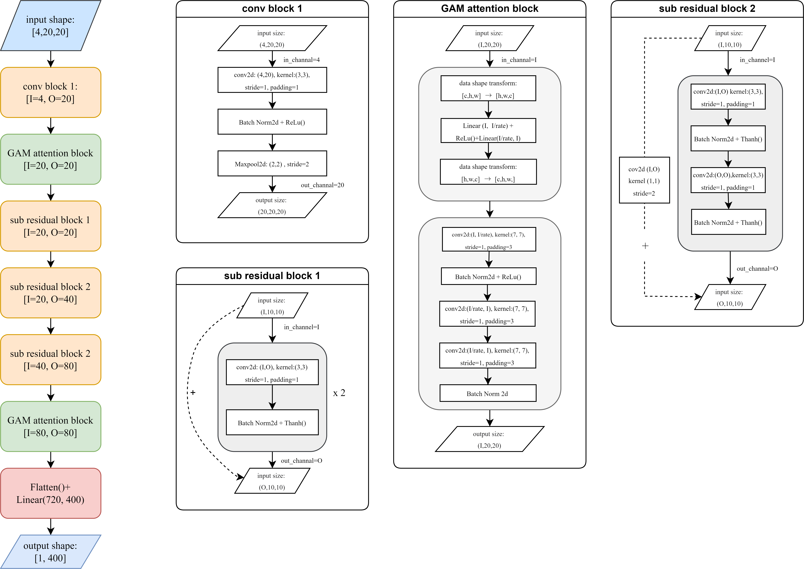

# Adaptive sampling for solving discrete high Dimensional PDEs

## Main work

This work mainly used for constructing a high-dimensional surrogate model in petroleum engineering. The main innovation is design a new neural network architecture which combines Rest-net and GAM attention.

## Data generating

single phase data are generated by FVM, using the `MeshGrid` class in `src.Mesh.py` to generate mesh samples, and then you can use `.solve_dynamic_press(self, dt, nt, p_last)` method to solve the PDEs of each sample.

In dataset folder, there are several data file about permeability, and other data such as pressure will be generated by permeability. Firstly we use file named `permeability-sgsim20x20-2100samples.txt` and `FVM.py` to generate single phase dataset for training and testing.
such as run the below command to get training  and testing data. You can generate 1 well data as well, just to change `-wn 1`
> `python FVM.py -t 30000 -n 150 -fn perm+press_4well.npz -wn 4`

Then there will be a file `perm+press_4well.npz` and 3 samples picture generated 

## Data driven model
> `python Data_driven.py -`